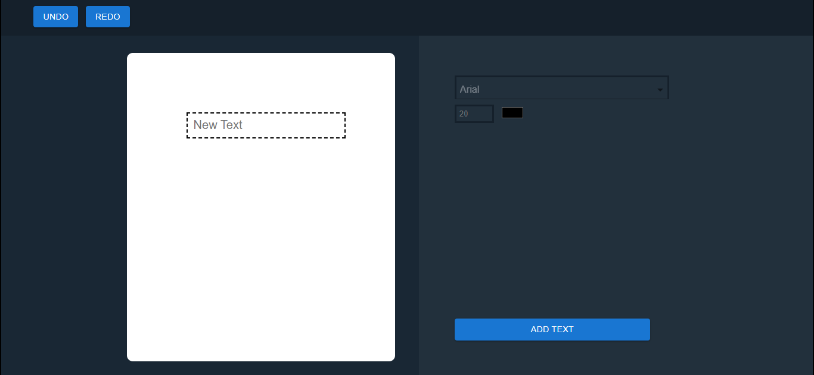
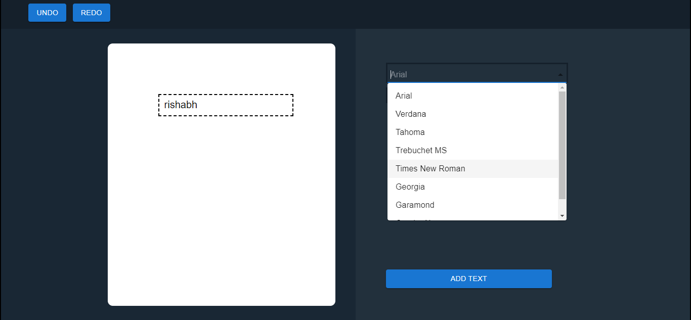
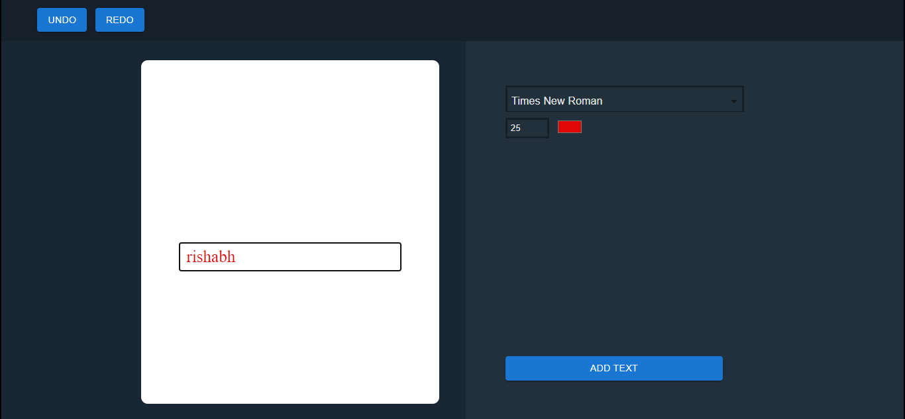
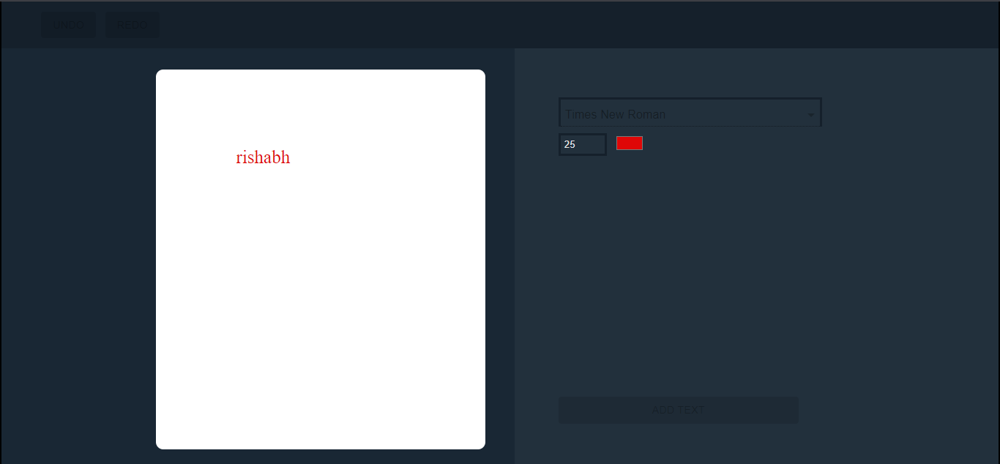

# Application Readme

## Getting Started

To start the application, follow these steps:

1. Open the terminal in the root folder of the project.
2. Run the command: `npm install –-legacy-peer-deps`
3. Once the node modules are installed completely, run the command: `npm start`

## Functionalities

Upon starting the application, the following page loads:

### Text Customization

You can change the text, size, font family and color using the options provides at the right side:

### Text Area Movement

The text area is movable across the canvas. You can click and drag to reposition it as desired:

### Undo and Redo

The application supports undo and redo functionality:

- **Undo Button:** Reverts back one step to the previous selections. For example, if you change the position or color, clicking undo will revert it to the previous state.

- **Redo Button:** Restores changes that were undone using the undo button. It can be used to redo the color changes, as shown in the example below.

### Adding Text

When you are done editing and satisfied with the changes, click on the "ADD TEXT" button. This will add your text to the canvas in its final edited state. Note that clicking "ADD TEXT" will disable all the edit options.

